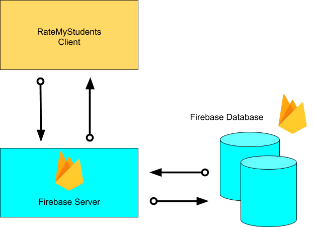

# ratemystudent
## Purpose
Rate My Student project is designed to give an opportunity for professors to rate their students, so that other professors and people can see before-hand the kind of students that are coming to their class. This can be useful for providing reputation for students who may want to enroll in selective class or program.
## Features
There’s an authentication system for teachers to login. We also will have profile creation that the teachers will make for the students. 
There is also a list of students to search from based off when their profiles were created.
## Students' Profile Page
### (picture here)
## System Architecture


## Instructions
``` 
1. git clone the repository
2. Navigate your current directory to /ratemystudent
3. npm install
4. npm start
6. You are ready to use Rate My Student!
7. Create your account from the sign up page
8. To add a new student click "New Student" and fill out the form
```
